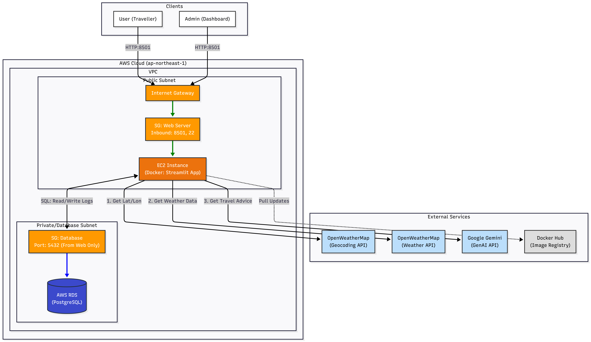
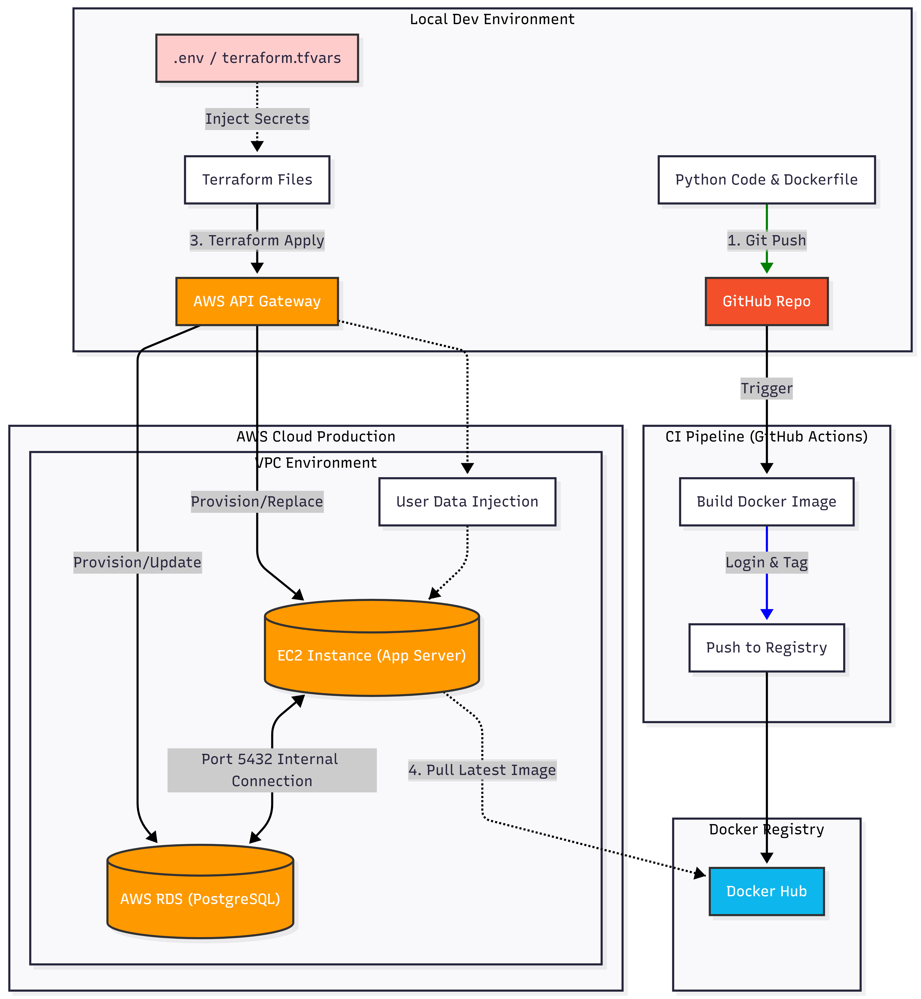
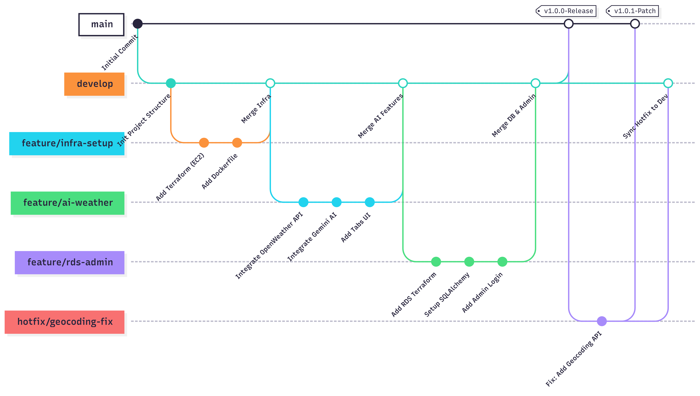

# 🤖 AI 氣象旅遊嚮導 (AI Weather & Travel Advisor)

[](https://github.com/Joliestudio/aws-weather-app/actions)
[](https://www.terraform.io/)
[](https://aws.amazon.com/)
[](https://streamlit.io/)
[](https://www.docker.com/)

系統能根據即時天氣數據，利用 AI 自動生成幽默且實用的旅遊建議，並將使用者查詢行為記錄至 AWS RDS 資料庫供管理員分析。

---

##  專案亮點 

###  智慧核心
* **AI 旅遊顧問：** 串接 **Google Gemini 2.5 Flash** 模型，根據氣溫、濕度、體感溫度提供即時穿搭與景點建議。
* **全球多語系支援：** 整合 **Geocoding API**，支援中/英文城市名稱搜尋 (e.g., "台北", "New York", "Tokyo")，解決傳統 OpenWeather API 無法辨識中文地名的問題。

###  互動式介面
* **視覺化儀表板：** 提供即時氣象指標 (溫度/濕度/風速/風向) 與互動式地圖定位。
* **JSON 開發者模式：** 內建 Debug 分頁，可查看並下載原始 API 回傳資料。

###  企業級後台
* **管理員權限控制：** 具備登入/登出機制 (`Session State` 管理)。
* **完整稽核日誌：** 記錄使用者 IP、查詢時間、地點與 AI 回應摘要至 **AWS RDS (PostgreSQL)**。
* **數據匯出：** 支援將查詢紀錄匯出為 CSV 報表。

---

##  系統架構 (Architecture)

本專案採用三層式架構，並透過 IaC 實現自動化部署。

### 1. 雲端實體架構 (Cloud Architecture)
包含 VPC 網路規劃、Public/Private Subnet 切分，以及 Security Group 的最小權限原則設定。

*(Web Server 位於 Public Subnet，RDS 資料庫位於受保護的 Private Subnet，僅允許 Port 5432 內部連線)*

### 2. CI/CD 自動化部署流程 (CI/CD Pipeline)
展示從本地開發、GitHub Actions 自動建置 Docker Image，到 Terraform 基礎設施部署的完整路徑。

*(包含機密資訊 Secrets Management 的安全注入流程)*

### 3. 多人協作 Git 流程 (Git Workflow)
採用 Gitflow 工作流，包含 Feature 分支開發、Hotfix 緊急修復與 Release 版本控制。


---

##  技術層 (Tech Stack)

| 類別 | 技術/工具 | 用途 |
| :--- | :--- | :--- |
| **Frontend** | Streamlit | 響應式 Web UI、數據視覺化 |
| **Backend** | Python 3.9+ | 核心邏輯、API 整合 |
| **Database** | **AWS RDS (PostgreSQL)** | 關聯式資料庫 (查詢日誌存儲) |
| **AI Model** | ** Gemini 2.5 Flash** | 生成式旅遊建議 |
| **API** | OpenWeatherMap | 氣象數據與地理編碼 (Geocoding) |
| **DevOps** | Docker | 容器化封裝 |
| **CI/CD** | GitHub Actions | 自動化測試與建置 |
| **IaC** | **Terraform** | AWS 雲端資源編排 (EC2, RDS, SG) |

---

##  快速開始 (Quick Start)

### 1. 環境準備
* AWS 帳號 (需具備 EC2 與 RDS 權限)
* OpenWeatherMap API Key
* Google Gemini API Key
* Terraform & Docker 已安裝

### 2. 本地端開發 (Local Development)

建立 `.env` 檔案設定環境變數：
(請參考.env.example)
```bash
cp .env.example .env

編輯 .env 內容：

Ini, TOML
OPENWEATHER_API_KEY=your_key
GOOGLE_API_KEY=your_key
# 若本地無 RDS，系統將自動使用 SQLite (local_test.db)
```

啟動應用程式：
```bash
pip install -r requirements.txt
streamlit run app.py
```
### 3. 雲端部署 (Deploy to AWS)
進入 Terraform 目錄並初始化：

```bash
cd terraform
terraform init
```
建立 terraform.tfvars (請勿上傳此檔案至 GitHub 並使用 .gitignore 忽略)：
(請參考.env.example)
```bash
cp .terraform.tfvars.example .terraform.tfvars
Terraform
docker_image    = "your-dockerhub-user/weather-app:latest"
weather_api_key = "your_weather_key"
google_api_key  = "your_gemini_key"
db_password     = "your_secure_db_password"
```
執行部署：

```bash
terraform apply
```
注意： RDS 資料庫建立約需 5-10 分鐘，請耐心等待。

## 管理員後台 (Admin Portal)
系統預設提供一組 Demo 管理員帳號供測試使用。 (Demo用，實務上並不會將帳密鎖死)

入口位置： 側邊欄選單 ->  管理者後台

帳號 (Username)： admin

密碼 (Password)： admin123

## 專案結構 (Project Structure)
Plaintext
.
├── .github/workflows/   # CI/CD GitHub Actions 設定檔
├── .venv/               # Python 虛擬環境 (包含所有安裝的依賴套件)
├── docs/                # 架構圖與文件圖片
├── terraform/           # IaC 基礎設施代碼 (main.tf, terraform.tfvars.example, variables.tf)
├── app.py               # 主程式 (Streamlit Frontend & Backend Logic)
├── requirements.txt     # Python 依賴套件
├── Dockerfile           # 容器建置腳本
├── .env.example         # 環境變數範本
└── README.md            # 專案說明文件